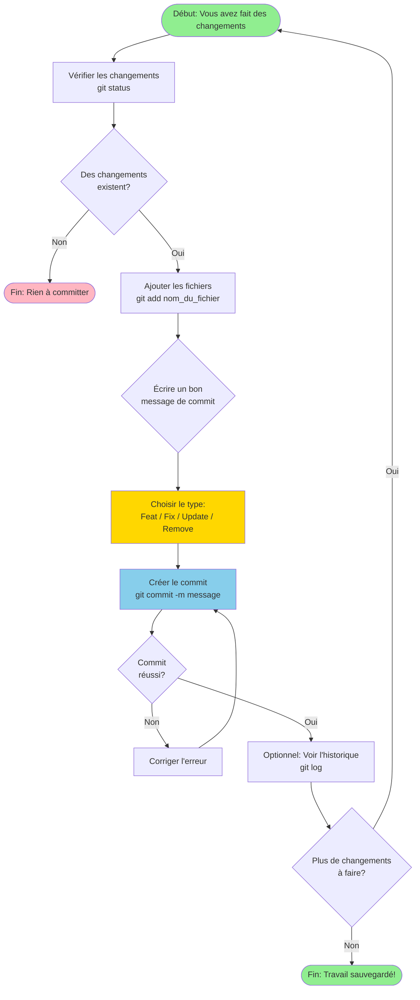

# Flowchart: Processus de Commit Git

## Légende des types de commit

- **Feat**: Nouvelle fonctionnalité
- **Fix**: Correction de bug
- **Update**: Mise à jour d'une fonctionnalité existante
- **Remove**: Suppression de code ou fonctionnalité

## Rappel Important

> **Faites des commits souvent!** Un commit est comme un point de sauvegarde dans votre projet.
