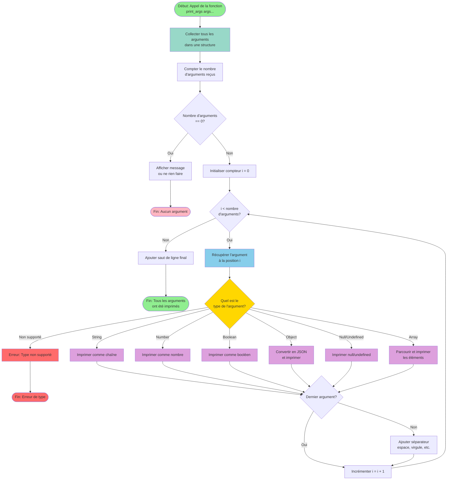

# Flowchart: Fonction pour Imprimer des Arguments Variables



## Exemples de fonctions variadiques

### JavaScript
```javascript
function printArgs(...args) {
    for (let i = 0; i < args.length; i++) {
        console.log(args[i]);
    }
}

// Utilisation
printArgs("Hello", 42, true, {name: "John"});
```

### Python
```python
def print_args(*args):
    for arg in args:
        print(arg)

# Utilisation
print_args("Hello", 42, True, {"name": "John"})
```

### C
```c
#include <stdio.h>
#include <stdarg.h>

void print_args(int count, ...) {
    va_list args;
    va_start(args, count);

    for (int i = 0; i < count; i++) {
        int value = va_arg(args, int);
        printf("%d ", value);
    }

    va_end(args);
}

// Utilisation
print_args(3, 10, 20, 30);
```

## Concepts Clés

- **Arguments Variables**: Une fonction peut accepter un nombre indéterminé d'arguments
- **Collection des arguments**: Le langage collecte automatiquement tous les arguments dans une structure (array, liste, etc.)
- **Itération**: La fonction parcourt tous les arguments un par un
- **Type Checking**: Selon le langage, on peut vérifier le type de chaque argument
- **Séparateurs**: On peut ajouter des espaces ou autres séparateurs entre les arguments
- **Gestion des cas limites**: Aucun argument, types non supportés, erreurs

## Limitations par Langage

### JavaScript / Python
- ✅ Nombre d'arguments illimité
- ✅ Types mixtes supportés
- ✅ Pas besoin de spécifier le nombre d'arguments

### C
- ⚠️ Il faut connaître le nombre d'arguments (passé en paramètre)
- ⚠️ Tous les arguments doivent être du même type (ou spécifier le type de chaque argument)
- ⚠️ Pas de vérification automatique - risque de bugs

### Java
- ⚠️ Les arguments variadiques doivent être du même type
- ⚠️ Ne peut y avoir qu'un seul paramètre variadique par fonction
- ⚠️ Doit être le dernier paramètre

## Options de Formatage

Vous pouvez personnaliser la sortie :
- **Séparateur personnalisé**: espace, virgule, nouvelle ligne
- **Préfixe/Suffixe**: ajouter des crochets, parenthèses
- **Format**: JSON, texte simple, tableau

```javascript
// Exemple avec séparateur personnalisé
function printArgs(separator, ...args) {
    console.log(args.join(separator));
}

printArgs(", ", "Apple", "Banana", "Orange");
// Output: Apple, Banana, Orange
```

## Avantages

✅ Flexibilité - Nombre d'arguments non fixé
✅ Réutilisabilité - Une seule fonction pour plusieurs cas
✅ Simplicité - Code plus propre et concis
✅ Lisibilité - Appels de fonction plus intuitifs
